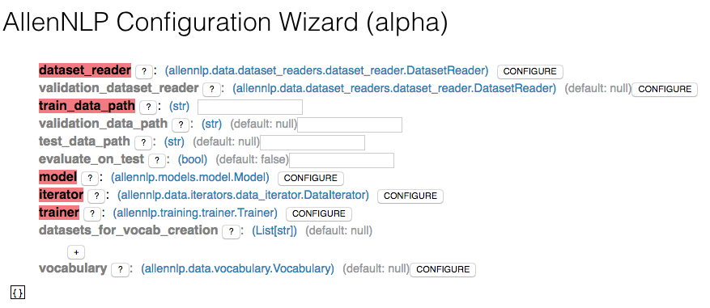
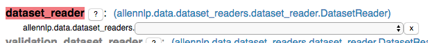
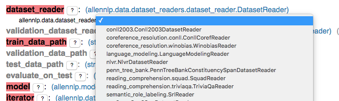
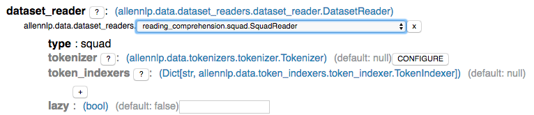
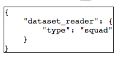

# Creating your Configuration File

AllenNLP实验会按照提供的JSON配置文件操作。

我们得到的一个常见的反馈是，很难知道配置文件中需要做什么。因此，我们已经建立了一些工具（这在某种程度上还是实验性的）来帮助你。

## 配置向导

我们已经创建了一个（处于实验期的）配置向导，它在浏览器中运行。启动它，只需要运行：

```bash
$ allennlp configure
serving Config Explorer at http://localhost:8123
```

然后浏览器打开 [localhost:8123](http://localhost:8123) 即可。



您可以在命令行版本中看到相同的字段和注释。（注释被隐藏为工具提示，鼠标在问号按钮上看到它们。）必填字段的名称为黑色，而可选字段的名称为灰色。未完成的必填字段以红色突出显示。

如果单击DATA的“配置”按钮，将会出现下拉菜单：



with the same choices as before:



如果再次选择SquadReader，将出现数据集读取器块的配置器：



注意，如果你决定不想要数据集阅读器配置，也有一个“X”按钮来删除数据集阅读器配置。

当您填写配置选项时，页面底部的实际JSON配置将实时更新：



如果您愿意，可以使用此向导填写整个配置，将生成的JSON复制到一个文件中，然后启动一个实验。

## 警告

这些特征是实验性的。特别地来说，配置向导的UI应该被认为是原型，并且在将来肯定会改进。